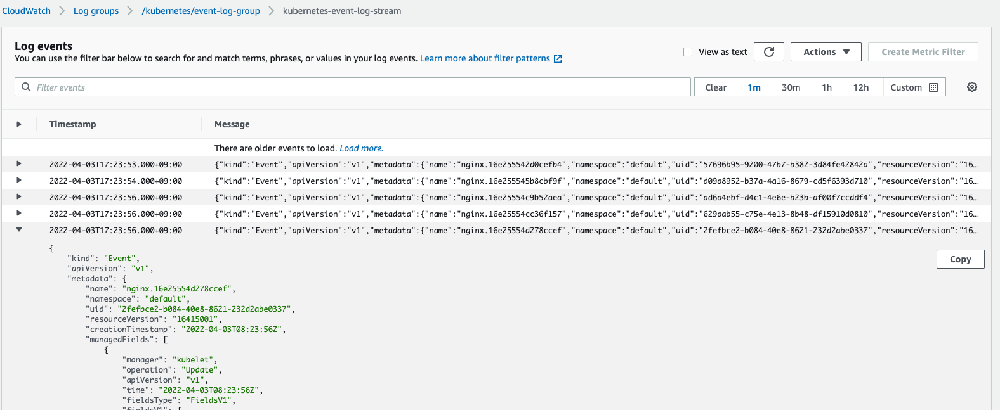

# kubebuilder-events-controller

This controller puts kubernetes events to CloudWatch Logs.

On Terminal
```
$ kubectl get event -A
NAMESPACE     LAST SEEN   TYPE      REASON                 OBJECT                                     MESSAGE
default       10s         Normal    Scheduled              pod/nginx                                  Successfully assigned default/nginx to ip-192-168-2-12.ap-northeast-1.compute.internal
default       9s          Normal    Pulling                pod/nginx                                  Pulling image "nginx"
default       7s          Normal    Pulled                 pod/nginx                                  Successfully pulled image "nginx" in 1.848090687s
default       7s          Normal    Created                pod/nginx                                  Created container nginx
default       7s          Normal    Started                pod/nginx                                  Started container nginx
...
```

CloudWatch Logs


## Setting

You can set environment values. [[manifest]](config/manager/manager.yaml)
```
        env:
        - name: CW_LOG_GROUP_NAME
          value: "/kubernetes/event-log-group"
          name: CW_LOG_STREAM_NAME
          value: "kubernetes-event-log-stream"          
          name: AWS_REGION
          value: "ap-northeast-1"      
```

* CW_LOG_GROUP_NAME: CloudWatch Logs group name (default - `/kubernetes/event-log-group`)
* CW_LOG_STREAM_NAME: CloudWatch Logs stream name (default - `kubernetes-event-log-stream`)
* AWS_REGION: region (default - `ap-northeast-1`)

## How to deploy this controller as a pod in your cluster
```
$ git clone https://github.com/a2ush/kubebuilder-events-controller.git
$ cd kubebuilder-events-controller
$ make docker-build docker-push IMG=<registry>/<project-name>:tag
$ make deploy IMG=<registry>/<project-name>:tag
```
You need to add `arn:aws:iam::aws:policy/CloudWatchAgentServerPolicy` to node IAM role when you don't use IRSA.

If you want to use IRSA, you can perform the following command.
```
$ git clone https://github.com/a2ush/kubebuilder-events-controller.git
$ cd kubebuilder-events-controller
$ make docker-build docker-push IMG=<registry>/<project-name>:tag

$ ACCOUNT_ID=$(aws sts get-caller-identity --query "Account" --output text)
$ OIDC_PROVIDER=$(aws eks describe-cluster --name cluster-name --query "cluster.identity.oidc.issuer" --output text | sed -e "s/^https:\/\///")
$ sed -i -e "s/<ACCOUNT_ID>/$ACCOUNT_ID/" -e "s|<OIDC_PROVIDER>|${OIDC_PROVIDER}|" irsa/trust.json 
$ aws iam create-role --role-name kubebuilder-events-controller --assume-role-policy-document file://irsa/trust.json --description "For kubebuilder-events-controller role"
$ aws iam attach-role-policy --role-name kubebuilder-events-controller --policy-arn=arn:aws:iam::aws:policy/CloudWatchAgentServerPolicy

$ make deploy IMG=<registry>/<project-name>:tag AWS_ACCOUNT_ID=${ACCOUNT_ID}
```

Environment
```
$ kubectl get all -n kubebuilder-events-controller-system 
NAME                                                                  READY   STATUS    RESTARTS   AGE
pod/kubebuilder-events-controller-controller-manager-5665ff56994wwm   2/2     Running   0          17m

NAME                                                       TYPE        CLUSTER-IP      EXTERNAL-IP   PORT(S)    AGE
service/kubebuilder-events-controller-cm-metrics-service   ClusterIP   10.100.169.42   <none>        8443/TCP   17m

NAME                                                               READY   UP-TO-DATE   AVAILABLE   AGE
deployment.apps/kubebuilder-events-controller-controller-manager   1/1     1            1           17m

NAME                                                                          DESIRED   CURRENT   READY   AGE
replicaset.apps/kubebuilder-events-controller-controller-manager-5665ff5695   1         1         1       17m
```

## How to test without deploying
```
$ git clone https://github.com/a2ush/kubebuilder-events-controller.git
$ cd kubebuilder-events-controller
$ make
$ make run
```
